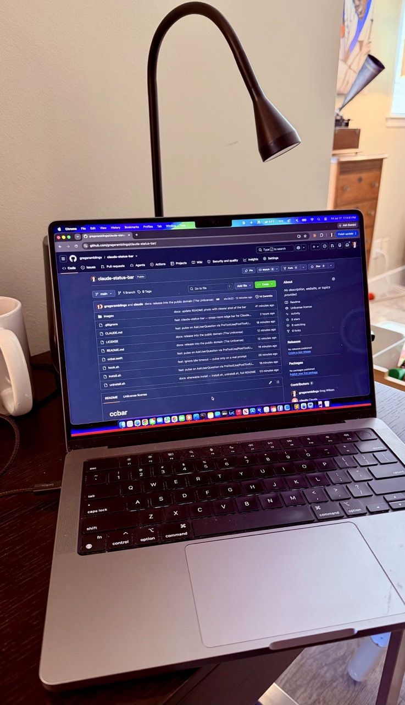

# ccbar

**Version 1.0**

A full-width **red bar** across the bottom edge of every screen that tells you, from
across the room, what Claude Code is doing.

- **Solid red bar** — at least one session is busy (Claude working).
- **Pulsing red bar** — a session **needs a response from you** now (a permission
  prompt, or Claude blocked waiting for input).
- **No bar** — a turn simply finished, or nothing running.

Busy wins: if any session is still working the bar is solid; it pulses only when one
has an active prompt for you (a permission request or an explicit question). A turn
that just *finishes* clears the bar. The bar is click-through (it never intercepts
your mouse) and floats above everything, including fullscreen apps, on every Space
and every monitor.

> Note: pulsing is driven by Claude Code's `Notification` hook, which fires for a
> real prompt (a permission request, etc.). The ~60s **idle** notification is
> deliberately ignored (`hook.sh` filters the "waiting for your input" message), so
> the bar never blinks just because a finished session is sitting there. One
> consequence: Claude Code has no distinct event for "ended a turn with a
> question," so a plain conversational question at the end of a turn reads as done
> (no bar) — only actual prompts pulse. Structured `AskUserQuestion` prompts *do*
> pulse, via a `PreToolUse`/`PostToolUse` hook on that tool.



*Solid red along the bottom edge = Claude is working; it pulses when Claude needs a response from you.*

## Requirements

- **macOS** (uses AppKit + `launchd`).
- **Xcode Command Line Tools** — provides `swiftc` to build. Install with:
  ```bash
  xcode-select --install
  ```
- **Claude Code CLI** — this is driven by [Claude Code](https://docs.anthropic.com/en/docs/claude-code)
  hooks. It works with any **locally-running** Claude Code (terminal or IDE
  extension). It does **not** work with cloud sessions (claude.ai/code) — those run
  remotely and can't reach your local machine.

No other dependencies: no Homebrew, no `jq`, no runtime. Just the system Swift
compiler and `plutil` (built into macOS).

## Install

```bash
git clone https://github.com/gregsramblings/claude-status-bar.git
cd claude-status-bar
./install.sh
```

`install.sh` builds the app, installs a run-at-login LaunchAgent (paths derived from
wherever you cloned — nothing hardcoded), starts it, then **prints a `hooks` block**.
Copy that block into `~/.claude/settings.json` (merge it into the top-level JSON
object; if you already have a `"hooks"` key, add the four events to it). The block
looks like this, with real paths filled in:

```json
"hooks": {
  "UserPromptSubmit": [{ "hooks": [{ "type": "command", "command": "bash /path/to/claude-status-bar/hook.sh busy" }] }],
  "Stop":            [{ "hooks": [{ "type": "command", "command": "bash /path/to/claude-status-bar/hook.sh waiting" }] }],
  "Notification":    [{ "hooks": [{ "type": "command", "command": "bash /path/to/claude-status-bar/hook.sh needs_input" }] }],
  "SessionEnd":      [{ "hooks": [{ "type": "command", "command": "bash /path/to/claude-status-bar/hook.sh end" }] }]
}
```

Then **start a new Claude Code session** and give it something to do — the red bar
appears while it works. (Hooks load at session start, so already-open sessions won't
drive the bar until restarted.)

### Verify

```bash
echo '{"session_id":"test"}' | ./hook.sh busy    # bar should appear
echo '{"session_id":"test"}' | ./hook.sh end     # bar should disappear
```

## Uninstall

```bash
./uninstall.sh
```

Stops and removes the LaunchAgent and the state directory. It intentionally does not
edit `settings.json` — remove the four ccbar `hooks` entries yourself, then delete
the repo folder.

## How it works

1. Claude Code **hooks** fire on state change and run `hook.sh`, which writes one
   small JSON file per session into `~/.claude/ccbar/state/<session_id>.json`:
   - `UserPromptSubmit` → `busy` (you handed off; Claude is working)
   - `Stop` → `waiting` (turn finished)
   - `Notification` → `notify`, which `hook.sh` splits into `needs_input` (a real
     prompt → pulse) or `waiting` (the idle timeout → no bar)
   - `PreToolUse` (matching `AskUserQuestion`) → `needs_input` (pulse while a
     multiple-choice question waits on you); `PostToolUse` → `busy` (solid again
     once you answer)
   - `SessionEnd` → deletes the file
2. `ccbar` (a tiny AppKit app, one borderless click-through window per screen at
   `.screenSaver` level, on all Spaces) polls the state directory every 0.4s: **solid**
   if any live session is `busy`, else **pulsing** if any is `needs_input`, else
   hidden (`waiting` — a finished turn — shows nothing).

Multi-session just works: each session is its own file keyed by `session_id`, so
three concurrent sessions share one bar — solid if *any* is working, pulsing if *any*
needs your input. Stale files (older than 12h, e.g. from a crash that skipped
`SessionEnd`) are ignored.

## Configuration

ccbar adds a small bar-shaped icon to the **macOS menu bar**. Click it to configure
the bar live — no rebuild, no restart:

| Menu item     | Default  | Meaning                                              |
|---------------|----------|------------------------------------------------------|
| **Position**  | Bottom   | Pin the bar to the Top or Bottom edge.               |
| **Thickness** | `10` px  | Bar thickness (presets `4`–`30`). Bump for a big room. |
| **Bar Color…** | red      | Opens the macOS color picker; recolors the bar live. |
| **About ccbar** | —      | Description, author, link to this repo.              |
| **Quit ccbar** | —       | Stops the app (unloads the LaunchAgent so it stays down). |

Choices persist in `UserDefaults` across restarts. The remaining tunables are still
compile-time constants at the top of `ccbar.swift` (rebuild + restart after changing —
`./install.sh` again does both):

| Constant       | Default | Meaning                                            |
|----------------|---------|----------------------------------------------------|
| `pollInterval` | `0.4`   | Seconds between state-dir polls.                   |
| `staleAfter`   | `43200` | Ignore state files older than this (seconds).      |

## Files

| File               | Purpose                                                        |
|--------------------|----------------------------------------------------------------|
| `ccbar.swift`      | The whole app (AppKit, single file).                           |
| `hook.sh`          | Claude Code hook target; writes one state file per session.    |
| `install.sh`       | Build + install LaunchAgent + print the hooks block.           |
| `uninstall.sh`     | Stop + remove the LaunchAgent and state dir.                   |
| `ccbar`            | Compiled binary (gitignored — built by `install.sh`).          |

## Notes

- **Fragility — the idle filter is a string match.** `hook.sh` distinguishes the
  ~60s idle notification from a real prompt by matching the substring
  `waiting for your input` in the notification `message`. This is Claude Code's
  current idle wording, not a stable API. If Anthropic changes that text, the idle
  timeout will start pulsing the bar again. The fix is one line — update the `case`
  pattern in `hook.sh`. (Conversely, only known idle text is suppressed, so any new
  message defaults to *pulse*, never to silently hiding a real prompt.)
- `Stop` is the main-agent stop only (`SubagentStop` is a separate, unhooked event),
  so the bar tracks real turn boundaries, not sub-agent churn.
- The bar sits at the very bottom edge. If your Dock is at the bottom and hides it,
  switch **Position → Top** or bump **Thickness** in the menu-bar menu.

## License

Public domain — [The Unlicense](LICENSE). Do whatever you want with it, no
attribution required, no warranty, no liability.
